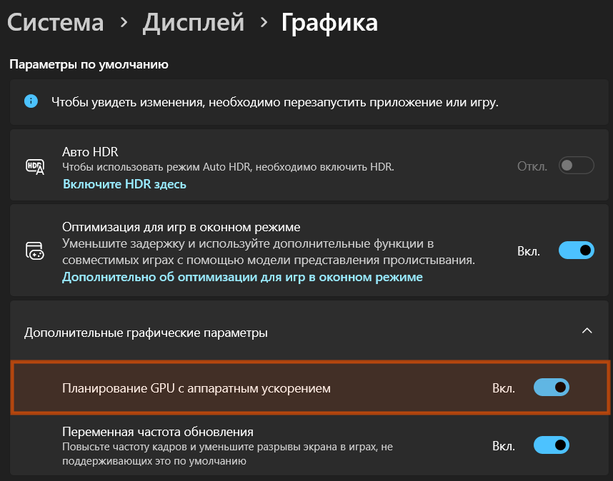

# Руководство по быстрой настройке blewred для стримеров (Quick Start Guide)

> **Простое пошаговое руководство без сложной технической терминологии.**  
> Выполните 4 простых шага, чтобы подготовить blewred к безопасным трансляциям на Twitch, YouTube и Kick.

---

## Чек-лист готовности к трансляции

```
[ Шаг 1: Видеокарта Nvidia GPU ] ──► [ Шаг 2: Модели ИИ ] ──► [ Шаг 3: Расширение ] ──► [ Шаг 4: OBS Studio ]
      DirectML & HAGS                  ViT + NudeNet 640m         Синхронизация таймингов        Плагин & Shield
```

---

## Шаг 1: Аппаратное ускорение Nvidia GPU (DirectML)

blewred использует нейросети, которые анализируют картинку прямо на вашей видеокарте через **Microsoft DirectML**. Это занимает всего **8–14 миллисекунд** и значительно слабее нагружает процессор (CPU) нежели использование без аппаратного ускорения GPU.

> [!TIP]
> **Нужно ли скачивать NVIDIA CUDA Toolkit или cuDNN?**  
> **НЕТ, не нужно!** В отличие от сред разработки Python, blewred использует современный API **Microsoft DirectML** поверх DirectX 12 Compute. Для работы нейросетей на видеокарте NVIDIA **достаточно обычного графического драйвера** (GeForce Game Ready или Studio Driver версии 535+). Скачивать тяжелые пакеты разработчика (CUDA, cuDNN на 3–5 ГБ), настраивать переменные среды PATH или компиляторы не требуется.

### 1.1. Проверка и обновление драйвера NVIDIA
Убедитесь, что у вас установлен актуальный видеодрайвер NVIDIA (Game Ready или Studio Driver):
1. Откройте приложение **NVIDIA App** или **GeForce Experience** и перейдите во вкладку **«Драйверы»**.
2. Если доступно обновление, нажмите **«Загрузить»** и выберите **«Экспресс-установка»** (рекомендуется версия драйвера 535.xx или новее).
3. Либо скачайте драйвер с официального сайта [nvidia.com/drivers](https://www.nvidia.com/download/index.aspx).

### 1.2. Выбор высокопроизводительного GPU в Windows 10/11
Особенно важно для **игровых ноутбуков** и ПК со встроенной графикой (Intel UHD / Iris Xe / AMD Radeon):
1. Откройте **Параметры Windows** (`Win + I`) -> **Система** -> **Дисплей** -> **Графика** (или нажмите кнопку **«Настройки графики Windows»** в приложении blewred).
2. В списке приложений найдите `blewred.exe`. Если его нет, нажмите **«Обзор»** и выберите `blewred.exe` в папке программы.
3. Нажмите кнопку **«Параметры»** напротив `blewred.exe`.
4. Выберите пункт **«Высокая производительность»** с вашей видеокартой NVIDIA GeForce и нажмите **«Сохранить»**.

### 1.3. Включение аппаратного планирования GPU (HAGS)
Функция HAGS снижает задержку захвата экрана в 2–3 раза:
1. В окне *«Параметры графики»* нажмите ссылку **«Изменение стандартных параметров графики»**.
2. Включите тумблер **«Планирование графического процессора/GPU с аппаратным ускорением» (HAGS)**.
3. Перезагрузите компьютер, чтобы изменения вступили в силу.

<div align="center">



</div>

### 1.4. Панель управления NVIDIA (NVIDIA Control Panel)
1. Нажмите правой кнопкой мыши на рабочем столе и откройте **«Панель управления NVIDIA»**.
2. Перейдите в раздел **«Управление параметрами 3D»** -> вкладка **«Программные настройки»**.
3. Нажмите **«Добавить»** и выберите `blewred.exe`.
4. В списке параметров найдите пункт **«Режим управления электропитанием»** и установите **«Предпочтителен режим максимальной производительности»**.
5. Нажмите **«Применить»** в правом нижнем углу.

---

## Шаг 2: Нейросетевые модели искусственного интеллекта

blewred использует связку из двух моделей:
* **Falconsai ViT Screener** — мгновенно за 2 мс отсекает 95% безопасных игровых сцен.
* **NudeNet 640m Localizer** — определяет точные координаты запрещенных анатомических зон для наложения цензуры.

### Проверка и загрузка в 1 клик:
1. В интерфейсе blewred в карточке «Модели нейросетей» или в выпадающем меню нажмите кнопку **«Проверить / Загрузить модели»**.
2. Приложение проверит наличие файлов `vit_nsfw.onnx` и `640m.onnx` в папке `models/` и сверит их контрольные суммы SHA-256.
3. Если статус показывает `Отсутствует` или `Поврежден`, нажмите кнопку **«Начать скачивание»**.
4. Файлы загрузятся автоматически в фоновом режиме с отображением реальной скорости и времени до окончания.

### Прямые ссылки для ручного скачивания (Офлайн / Зеркала):
Если вы настраиваете систему без интернета или предпочитаете скачать модели вручную, загрузите оба файла `.onnx` и сохраните их в каталог `models/` в корне проекта или установленной программы:

| Модель | Ступень | Размер | Назначение в `models/` | Прямые ссылки на скачивание | Контрольная сумма SHA-256 |
| :--- | :--- | :--- | :--- | :--- | :--- |
| **Falconsai ViT Classifier** | Ступень 1 (Быстрый скринер) | ~83.3 МБ | `models/vit_nsfw.onnx` | • [Hugging Face (Основная)](https://huggingface.co/onnx-community/nsfw_image_detection-ONNX/resolve/main/onnx/model_quantized.onnx)<br>• [Hugging Face Зеркало](https://huggingface.co/d0gr/falconsai-nsfw-detector-onnx/resolve/main/nsfw_classifier/model.onnx)<br>• [GitHub Зеркало](https://github.com/blewred/blewred/releases/download/v1.0.0/vit_nsfw.onnx) | `10354606f3442d24308c0a37d1fd6205ab7ce7bf31669e186a4fc5cf7f51b455` |
| **NudeNet 640m Localizer** | Ступень 2 (Точный детектор) | ~98.7 МБ | `models/640m.onnx` | • [Hugging Face (Основная)](https://huggingface.co/zhangsongbo365/nudenet_onnx/resolve/main/640m.onnx)<br>• [GitHub Зеркало (notAI-tech)](https://github.com/notAI-tech/NudeNet/releases/download/v0/640m.onnx) | `5fd488c39acfb268efb4a92bce4fbc95967c059bd7ee1c01026fcaf81aec5c9e` |

> [!NOTE]
> Если при скачивании по основной ссылке Hugging Face файл называется `model_quantized.onnx` или `model.onnx`, переименуйте его в **`vit_nsfw.onnx`** перед помещением в папку `models/`. Приложение автоматически проверит хеш SHA-256 при запуске.

---

## Шаг 3: Браузерное расширение (Синхронизация таймлайна плеера)

Расширение связывает HTML5-видеоплееры в браузере (YouTube, VK Видео, Twitch и др.) с ядром blewred по локальному адресу `ws://127.0.0.1:51789`. Оно непрерывно передает текущую позицию воспроизведения (`currentTime`), факт перемотки и паузы, автоматически сопоставляя их с запланированными таймингами (Scheduled Cues) для упреждающего предупреждения стримера и автоматического включения цензуры.

### Инструкция по установке (Google Chrome, Brave, Яндекс.Браузер, Microsoft Edge):
1. Откройте ваш браузер и перейдите в раздел расширений:
   * **Chrome / Яндекс**: введите в адресную строку `chrome://extensions/`
   * **Brave**: введите в адресную строку `brave://extensions/`
   * **Edge**: введите в адресную строку `edge://extensions/`
2. В правом верхнем углу страницы включите переключатель **«Режим разработчика»** (Developer mode).
3. В появившемся верхнем меню нажмите кнопку **«Загрузить распакованное расширение»** (Load unpacked).
4. В открывшемся окне проводника выберите папку **`extensions/chrome`** в каталоге blewred (вы можете быстро открыть эту папку, нажав кнопку **«Открыть папку расширения»** в чеклисте blewred).
5. Нажмите **«Выбор папки»**.
6. Закрепите значок blewred на панели браузера. Индикатор **«Расширение»** в шапке blewred загорится зелёным статусом **ON**.

---

## Шаг 4: Связка с OBS Studio и проверка безопасности

blewred накладывает блюр и заставки **напрямую в графическом конвейере OBS Studio** до того, как кадр уходит на сервера Twitch/YouTube. Ваш собственный монитор остается абсолютно чистым и без артефактов.

### 4.1. Включение WebSocket в OBS Studio
1. Откройте **OBS Studio** (версия 28.0 или новее).
2. В верхнем меню выберите **«Инструменты» (Tools)** -> **«Настройки сервера WebSocket» (WebSocket Server Settings)**.
3. Поставьте галочку **«Включить сервер WebSocket»**.
4. Убедитесь, что порт сервера установлен на **`4455`**.
5. Если задан пароль — при первом подключении укажите его в настройках OBS в blewred (по умолчанию пароль отключен).

### 4.2. Автонастройка в 1 клик
1. В интерфейсе blewred нажмите кнопку **«Автонастройка OBS»**.
2. Программа автоматически:
   - Внедрит плагин `obs-blewred.dll`.
   - Создаст аппаратный шейдерный фильтр блюра на источнике захвата экрана.
   - Развернет стильную заставку **Censor Shield** (`blewred_Censor_Shield`) во всех сценах трансляции с поддержкой двух языков (RU/EN), синхронизированной с настройками приложения.

### 4.3. Выбор монитора для анализа
В выпадающем списке **«Монитор стрима»** отображаются все подключенные физические мониторы (например, «Монитор 1 (Основной)», «Монитор 2», «Монитор 3»):
* Выберите именно тот монитор, на котором транслируется контент или игра.
* Видеоанализ нейросетью и OCR происходит **строго на выбранном физическом мониторе**, без рассинхронизации и ложных переключений.

### 4.4. Горячие клавиши стримера (Hotkeys)
Проверьте работу клавиш быстрого реагирования:
* **F9 (Экстренная цензура / Паник-кнопка)**: мгновенно глушит микрофон и звук рабочего стола в OBS на 3 секунды и при необходимости разворачивает заставку Censor Shield.
* **F8 (Усиленный режим)**: форсирует видеоанализ с 5 до 60 кадров в секунду (полезно при переходе на рискованные сайты или в чаты со зрителями).

> 💡 **Настройка горячих клавиш**: В `blewred` любые горячие клавиши можно свободно переназначать по кнопке **«Горячие клавиши»** в верхней панели интерфейса. Поддерживаются составные комбинации с модификаторами (`Ctrl`, `Alt`, `Shift`, `Win`), интерактивная запись с клавиатуры и выбор области действия (глобально в Windows или локально в приложении).

---

## Часто задаваемые вопросы (FAQ) и решение проблем

| Проблема | Причина | Простое решение |
| :--- | :--- | :--- |
| Цензура срабатывает не на том мониторе | В blewred выбран другой монитор, отличный от стрим-экрана | В списке «Монитор стрима» выберите нужный физический монитор (1, 2 или 3). Система будет сканировать строго его. |
| Индикатор «Расширение» горит серым (OFF) | Расширение не запущено или браузер закрыт | Откройте браузер с установленным расширением. Убедитесь, что страница видео открыта. |
| Индикатор «OBS Studio» горит OFF | Сервер WebSocket не включен в OBS | В OBS Studio откройте *Инструменты -> Настройки сервера WebSocket*, включите сервер на порту 4455. |
| Видеоанализ работает на CPU вместо GPU | Windows выбрала встроенную видеокарту | Выполните **Шаг 1.1** данного руководства и назначьте высокую производительность NVIDIA GPU для `blewred.exe`. |
| Пропали или повреждены файлы нейросетей | Файлы не были загружены при первом старте | Нажмите кнопку **«Проверить / Загрузить модели»** и запустите фоновое скачивание. |
| Как скрыть панель настройки с экрана? | Настройка уже завершена | Нажмите крестик (`×`) в правом верхнем углу панели или поставьте галочку «Больше не показывать при запуске». В любой момент панель можно снова открыть по кнопке «Гайд настройки» в шапке. |
